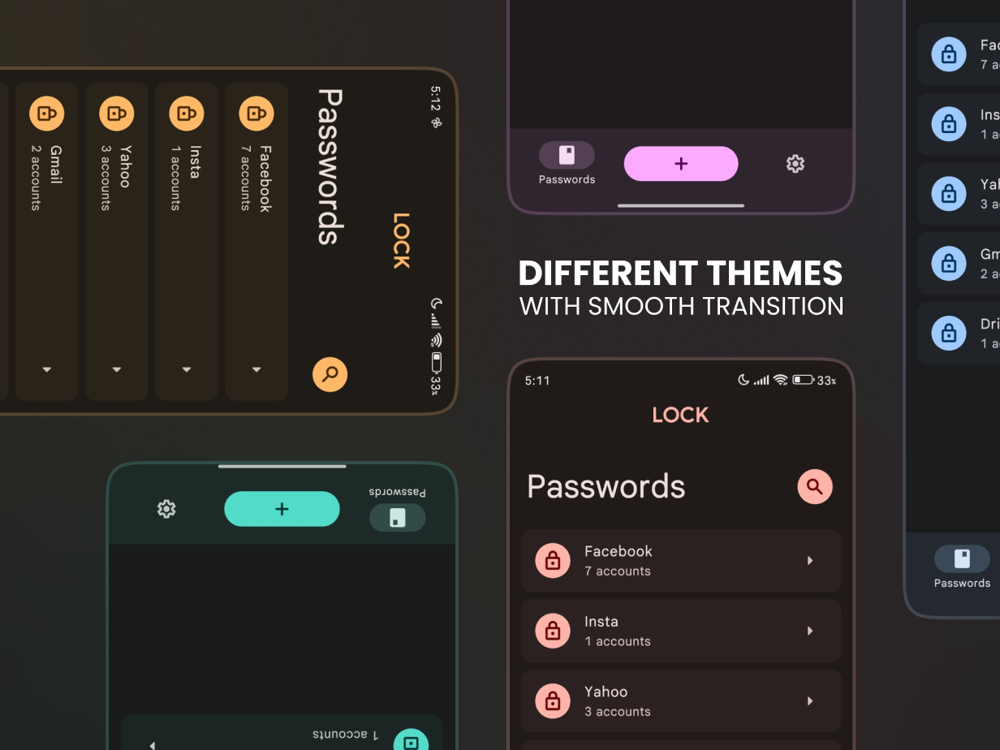
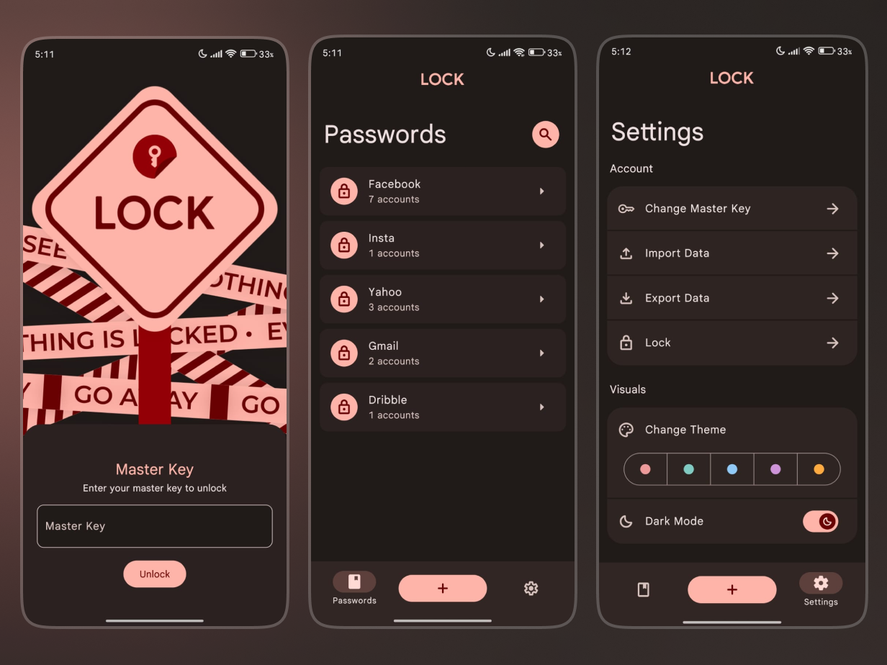
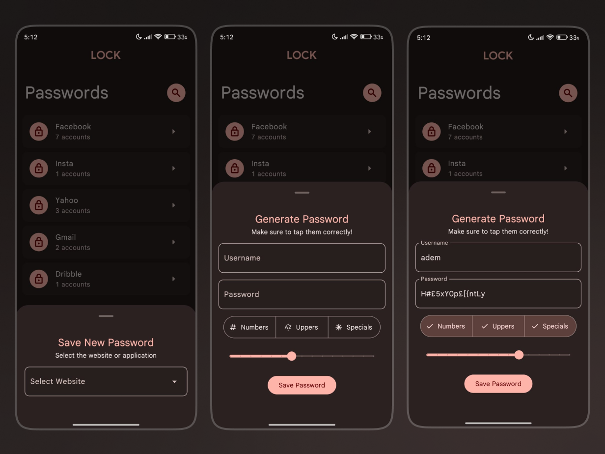
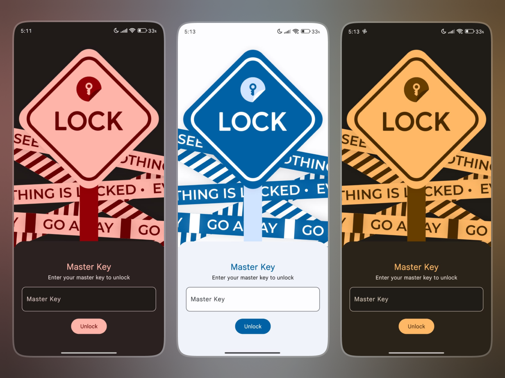

# 🔐 Password Manager

A secure, modern password manager built with Flutter that helps you store, generate, and manage your passwords with military-grade encryption.

## 📱 Preview

<div align="center">
  
  
  
  
</div>

## ✨ Features

### 🔒 **Security First**

- **AES Encryption**: Military-grade encryption for all stored passwords
- **Biometric Authentication**: Fingerprint and face unlock support
- **Master Key Protection**: Single master password to access all your data
- **Local Storage**: All data stored locally on your device - no cloud dependency

### 🎨 **User Experience**

- **Material Design 3**: Modern, intuitive interface
- **Dark/Light Themes**: Support for both light and dark modes
- **Customizable Colors**: Multiple color schemes to personalize your experience
- **Smooth Animations**: Fluid transitions and micro-interactions
- **Cross-Platform**: Works on Android, iOS, and Web

### 🔧 **Advanced Features**

- **Import/Export**: Backup and restore your password database
- **Password Validation**: Real-time password strength checking
- **Copy to Clipboard**: Quick password copying with security notifications
- **Auto-Lock**: Automatic app locking for enhanced security

## 🚀 Getting Started

### Prerequisites

- Flutter SDK (>=3.2.3)
- Android Studio / VS Code
- Android/iOS device or emulator

### Installation

1. **Clone the repository**

   ```bash
   git clone https://github.com/adeemmm23/password_manager.git
   cd password_manager
   ```

2. **Install dependencies**

   ```bash
   flutter pub get
   ```

3. **Set up environment variables**
   Create a `.env` file in the root directory:

   ```env
   ENCRYPTION_KEY=your_32_character_encryption_key_here
   ENCRYPTION_IV=your_16_character_iv_here
   ```

4. **Run the app**

   ```bash
   flutter run
   ```

## 🏗️ Project Structure

```
lib/
├── main.dart                 # Application entry point
├── router.dart              # Navigation configuration
├── components/              # Reusable UI components
├── features/               # Feature-based organization
│   ├── authentication/     # Login and biometric auth
│   └── home/              # Main app screens
│       ├── passwords/     # Password management
│       └── settings/      # App settings
├── global/                # Global state and constants
└── utils/                 # Utility functions
    ├── password_generator.dart
    ├── passwords_storage.dart
    └── validators.dart
```

## 🔐 Security Architecture

### Encryption

- **Algorithm**: AES-256 encryption
- **Key Management**: Environment-based key storage
- **Data Protection**: All passwords encrypted before storage

### Authentication Flow

1. **Biometric Check**: Attempt biometric authentication first
2. **Master Key Fallback**: Use master password if biometric fails
3. **Session Management**: Secure session handling with auto-lock

### Data Storage

- **Local Only**: No data transmitted to external servers
- **Encrypted Storage**: All sensitive data encrypted at rest
- **Secure Preferences**: Using Flutter's secure storage mechanisms

---

**⚠️ DO NOT USE YET**: This app is still in development and isn't for production yet.
